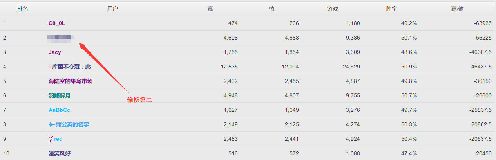

# PT_Scripts
这个仓库放一些用在PT上的脚本

之后可能会写一个稍微大一点的？先画个饼吧。。

需求分析

- 多数教育网PT站资源列表爬取
- 划分方式：按PT站/按资源种类
- 页面带超链接：直达页面 + 种子下载按钮
- 登录模块（验证码识别）
- 全站Free提醒/活动提醒
- 个人信息部分

### 其他脚本

- Robot21 - 自动玩21点脚本

  暂时只是模仿人去玩21点。。后台蜜汁发牌策略真是搞不懂。。看了源码好像坑爹的连判重都没有。。

  其实系统收手续费才是真正的赢家。。

  贴个战绩。。

  

